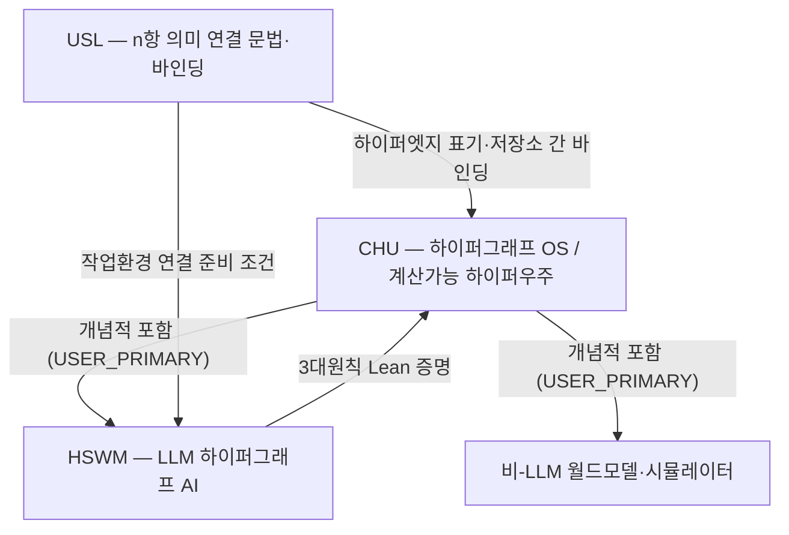

# CHU · HSWM · USL — 하나의 하이퍼그래프 생태계

2026-09-29 · 사용자 정의의 개념적 관계 지도. 실행·통합 완료 여부는 [current engineering view](engineering/README.md)와 [`os/README.md`](os/README.md)의 증거 범위로 확인한다.

| 저장소 | 한 줄 정체성 | 권위 |
|---|---|---|
| [**CHU**](https://github.com/gj3447/CHU) | 계산가능 하이퍼우주 — 월드모델과 HSWM을 모두 포함하는 가장 넓은 개념이자, 그것을 작업환경으로 실현하는 **하이퍼그래프 OS** | USER_PRIMARY ([범위](canon/sources/USER_PRIMARY_CHU_HSWM_SCOPE_2026-09-27.txt), [OS](canon/sources/USER_PRIMARY_CHU_HYPERGRAPH_OS_2026-09-29.txt)) |
| [**HSWM**](https://github.com/gj3447/HSWM) | CHU 안의 **LLM 전용** 하이퍼그래프 AI — Semantic Weight 그래프가 상태, LLM이 국소 연산자 | USER_PRIMARY ([범위](canon/sources/USER_PRIMARY_CHU_HSWM_SCOPE_2026-09-27.txt)) |
| [**USL**](https://github.com/gj3447/USL) | Universal Semantic Link — 서로 다른 시스템의 자원을 **의미 + 이름 있는 역할 + 실제 참조**로 묶는 n항 연결 문법·바인딩 도구 (자체 DB 없음) | USL README |

## 서로에게 무엇인가 (`SECONDARY_AI` 대응 — 각 저장소 자체 정의는 바꾸지 않음)

| 관계 | 내용 |
|---|---|
| **CHU ⊇ HSWM** | 사용자 정의 그대로. HSWM은 CHU OS 위에서 살도록 정의된 LLM AI이며, 계획상 CHU OS의 메모리·파일시스템이 HSWM의 Semantic Weight 그래프를 담는 기반이 된다. 현재 guest HSWM 통합은 완료되지 않았다. ([3대원칙](canon/AI_NATIVE_THREE_PRINCIPLES.md) ③: LLM = ROM, CHU = 메모리, Semantic Weight = 프로그램) |
| **USL ↔ CHU** | USL 링크 = `meaning + participants[{role, resource}]` = **역할 있는 n항 하이퍼엣지**. "checkout이 이동해도 자원 ID는 유지하고 표현(경로·URL·commit)만 고른다"는 USL 원칙은 CHU의 "정체성은 ID, 경로는 뷰" 원칙과 같다. 그래서 CHU OS는 저장소 **밖** 자원과 저장소 **사이** 연결을 USL 문법으로 표기한다. USL은 DB가 아니므로 상태의 정본은 CHU store가 갖고, USL은 그것을 가리키고 묶는다. |
| **USL ↔ HSWM** | HSWM 연결 실행 전에는 USL 작업환경 등록·소유자 승인·도달성 확인이 필요하다(공통 AGENTS 블록). USL `connections/hswm/`이 HSWM 연구 자료를 바인딩한다. |
| **HSWM → CHU** | 3대원칙의 계산적 핵심은 HSWM `formal/`에서 Lean 검증됐고 CHU는 그것을 링크로 인용한다 ([증명 상태](canon/AI_NATIVE_THREE_PRINCIPLES.md#증명-상태-2026-09-29-재검증)). |

## 실제 연결 지점

- **USL 바인딩**: [`gj3447/USL/connections/chu/`](https://github.com/gj3447/USL/tree/master/connections/chu) — CHU·HSWM·USL 자원을
  고정 commit·SHA-256으로 결속하고, 위 관계를 USL 링크(하이퍼엣지)로 기록. 사용법: [USL `docs/CHU_CONNECTION.md`](https://github.com/gj3447/USL/blob/master/docs/CHU_CONNECTION.md).
- **공통 에이전트 규칙**: 세 저장소의 `AGENTS.md`에 같은 `usl-workspace-linking` 블록.
- **공통 라이선스**: 세 저장소 모두 AGPL-3.0-or-later 또는 별도 상용 라이선스, © Ra Gyeongjun ([LICENSING.md](LICENSING.md)).
- **로컬 배치**: `~/CD/{CHU,HSWM,USL}`은 개발자의 한 작업공간 투영이다. 자원 정체성이나 통합 완료 증거가 아니며, 상대 링크는 그 배치에서만 해석된다.
- **CHU OS 계획과의 연결**: [계획](plan/CHU_OS_PLAN.md)의 T31(링크 추출)·T42(에이전트 포트)·T52(분산 백엔드)는 USL 바인딩과 HSWM 실행 경로를 재사용한다.
