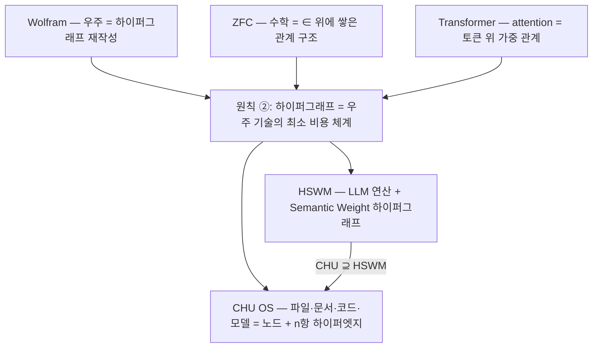

# 왜 하이퍼그래프인가 — Wolfram · ZFC · Transformer · HSWM

2026-09-29 · 원칙 ②([3대원칙](canon/AI_NATIVE_THREE_PRINCIPLES.md))의 근거 지도

> **사용자 주장 (USER_PRIMARY):** 우주는 이미 존재하고, 그것을 이해·기술하는 **최소 비용의 체계가
> 하이퍼그래프**다. 빛이 페르마 원리로 최단시간 경로를 택하듯, 서로 독립적인 세 체계 —
> Wolfram 우주 모형, ZFC 수학 기초, Transformer — 가 모두 하이퍼그래프로 모였다.
> 그래서 CHU(하이퍼그래프 OS)와 HSWM(LLM 하이퍼그래프 AI)은 하이퍼그래프 위에 선다.

이 문서는 그 주장을 **정본으로 유지**하면서, 각 사례에서 무엇이 확인됐고 무엇이 아직
열린 연구인지를 CHU 설계 결정과 함께 한 장에 묶는다. 판정 근거는 HSWM의
[최소비용 가설 검토](../HSWM/docs/research/HSWM_MINIMUM_COST_HYPERGRAPH_HYPOTHESIS_2026-09-27.md)
(원 논문 확인 2026-09-27)를 따른다.

---

## 1. 네 기둥 한눈에



| 기둥 | 하이퍼그래프로 보이는 지점 | 확인된 범위 | 열린 연구 | CHU OS에 가져오는 것 |
|---|---|---|---|---|
| **Wolfram** 우주 모형 | 상태 = 관계들의 집합(hyperedge), 동역학 = 규칙 `H₁→H₂` 재작성, 이력 = multiway 그래프 | 모형 자체가 명시적 하이퍼그래프 재작성 체계 ([technical intro](https://www.wolframphysics.org/technical-introduction/)) | 실제 우주 모형으로 확정됐는지 | **이론/프로토타입에 반영**: 상태=하이퍼그래프, 변경=재작성, 이력=multiway. [`lean/CHU_WolframRewrite.lean`](lean/CHU_WolframRewrite.lean)(9 정리)와 [`chu_core.rs`](chu_core_prototype/chu_core.rs)는 이 층을 다루며, OS kernel·HSWM 실행 완료 증거는 아님 |
| **ZFC** 수학 기초 | 모든 대상이 `∈` 관계로 쌓인 구조; 집합 = 원소들을 한 번에 묶는 하이퍼엣지 | 원시 관계는 **이항** `∈` 하나이고, 순서쌍·관계·하이퍼그래프는 그 위에서 **정의**된다 ([Oxford §2](https://people.maths.ox.ac.uk/zilber/ast-web.pdf), [mathlib ZFC](https://leanprover-community.github.io/mathlib4_docs/Mathlib/SetTheory/ZFC/Basic.html)) | ZFC가 비용 최적화로 하이퍼그래프에 "수렴"했다는 주장 | **폴더의 올바른 대체물**: 폴더(단일 부모 트리) 대신 집합 = 그룹 하이퍼엣지(다중 소속). 정체성 = 외연(내용)→ CID. CHU 기존 [`axiom CHU : Type`](lean/AirplaneMan.lean) + `CHUPiece := CHU → Prop`이 이 층 |
| **Transformer** | 한 층의 attention이 모든 토큰을 동시에 묶는 가중 관계; multi-head = 여러 관계 유형 | attention은 그래프로 해석 가능 ([Graph-to-Graph](https://research.google/pubs/transformers-as-graph-to-graph-models/)), 명시적 하이퍼그래프 Transformer도 존재 ([HyperGT](https://arxiv.org/abs/2312.11385)) | 표준 Transformer가 하이퍼그래프로 **수렴진화**했다는 기술사적 사실 | **실행 단위(ROM)**: LLM은 그래프 국소 영역을 읽고 쓰는 연산자. 그래프 ↔ 토큰 문맥 변환이 OS의 표준 syscall. 상세: [HSWM Transformer 수학](../HSWM/docs/research/HSWM_TRANSFORMER_ARCHITECTURE_AND_MATH_2026-09-14.md) |
| **HSWM** | 큰 Semantic Weight 하이퍼그래프 = AI 상태, LLM = 국소 연산자 | 원칙 ①②③의 계산적 핵심 Lean 검증 (14 모듈, sorry 0 — [3대원칙 문서](canon/AI_NATIVE_THREE_PRINCIPLES.md#증명-상태-2026-09-29-재검증)) | 실모델 효능, 보편 최적성 | **CHU 안의 LLM 전용 AI**. CHU OS는 HSWM이 사는 메모리·파일시스템이자, 비-LLM 월드모델도 담는 더 넓은 기반 |

## 2. 페르마 비유를 설계 규칙으로

페르마 원리의 정확한 형태는 "경로 변동에 대한 시간의 **정류** 조건"이다
([Feynman I §26-5](https://www.feynmanlectures.caltech.edu/I_26.html#Ch26-S5)).
CHU는 이것을 **표현 선택 규칙**으로 쓴다: 같은 정보·같은 질의를 같은 정확도로 처리하는 표현
가운데 전체 비용(설명 길이·저장·읽은 토큰·실행·갱신·변환)이 작은 쪽을 택한다.

```math
\min_{R}\; C_Q(R) \quad \text{s.t.}\quad D_Q(R) \le \epsilon
```

- **폴더 트리가 비싼 이유 (설계 가설):** 한 파일이 여러 주제에 속하면 트리는 복사·심볼릭 링크·
  중복 README로 우회해야 한다. 하이퍼엣지 하나면 된다. 이것을 CHU 저장소 자체로 측정하는 것이
  계획 노드 **T06**이다 ([계획](plan/CHU_OS_PLAN.md)).
- **공정 비교 의무:** 역할을 표시한 incidence/factor 그래프도 n항 관계를 무손실로 담는다
  (Lean `decode_encodeNary`). 그래서 CHU는 "이항 그래프는 표현 불가"를 전제로 삼지 않고,
  **n항 의미 조직**을 정본으로, 저장 형식은 비용 측정으로 고른다.

## 3. 세 체계가 CHU OS의 세 층이 된다

| CHU OS 층 | 담당 기둥 | 3대원칙 | 기존 CHU 자산 |
|---|---|---|---|
| **정체성·소속** (무엇이 있고 어디에 속하나) | ZFC — 외연·집합·다중 소속 | ② | `axiom CHU : Type`, `CHUPiece`, JaebaeMan(재귀 커버), Univalent StateStore |
| **동역학·이력** (어떻게 바뀌나) | Wolfram — 재작성·multiway | ②③ | `CHU_WolframRewrite.lean`, `chu_core.rs` evolve / 4 포트 |
| **실행·층 변환** (누가 읽고 실행하나) | Transformer/LLM — 국소 연산자, M = Map | ①③ | HSWM `SemanticSoftware` / `OperationalAbstraction` (링크) |

## 4. 출처 지도 (가져온 것 / 링크한 것)

- **복사해 가져옴 (CHU가 정본 사본 보유):**
  - CHU Lean 11개 → [`lean/`](lean/) (MIND `lean_formalization` 10개 + Mac 스냅숏의 `CHU_WolframRewrite.lean`에서 가져온 현재 CHU 사본). Lean 4.34.1의 2026-09-29 재검증 관찰은 [`docs/STATUS.md`](docs/STATUS.md)에 있으며, 현재 상태는 `./chu repo status --json`으로 확인.
  - 사용자 원문 6개 → [`canon/sources/`](canon/sources/).
- **링크 (HSWM이 정본):** 세 철학 Lean 4개 + 의존 모듈, 최소비용 가설 검토, CHU–HSWM 계산 구조
  ([문서](../HSWM/docs/research/CHU_HSWM_COMPUTATIONAL_ARCHITECTURE_2026-09-27.md)),
  Wolfram 관계 능력 계획 ([문서](../HSWM/docs/research/HSWM_WOLFRAM_RELATIONAL_CAPABILITY_RESEARCH_PLAN_2026-09-06.md)),
  Transformer 수학 ([문서](../HSWM/docs/research/HSWM_TRANSFORMER_ARCHITECTURE_AND_MATH_2026-09-14.md)).
- **CHU 내부 선행 연구:** [PROM 16 A2 하이퍼그래프·n항 우주](PROM_16_axis_findings/A2_Hypergraph_NaryUniverse.md),
  [Ruliad grounding](PROM_16_RULIAD_GROUNDING_REPORT_2026-07-15.md), [SOURCES](SOURCES.md) (Wolfram/Friedman/Voevodsky).

## 5. 정직한 경계

- 사용자 주장(보편 최소 비용, 세 체계의 수렴진화)은 **정본 방향**이며 이 문서가 참이라고 증명하지 않는다.
  증명된 것은 §1 표 "확인된 범위"와 [3대원칙](canon/AI_NATIVE_THREE_PRINCIPLES.md) 증명 표까지다.
- CHU를 Pratt의 Chu spaces, Tegmark CUH, Wolfram Ruliad와 **동일시하지 않는다** (HSWM 아키텍처 문서의 기존 경계 유지).
- 수렴진화 주장을 시험하려면 각 체계의 출발 구조·선택 압력·비용 지표·대안 경로가 필요하다 — 계획 노드 **T07**.
