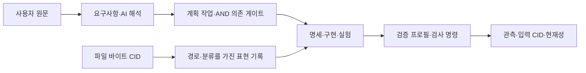

# CHU 전체 저장소의 그래프 지도

2026-10-02 · `SECONDARY_AI` 정리. 범위는 **이 CHU Git 저장소의 추적 파일과 ignore되지 않은
새 파일 전체**다. `.chu`, `.venv`, 빌드 캐시, 형제 저장소, 공유 KG는 수집하지 않는다.
사용자 정전은 [원문](../canon/sources/)에 있고, CHU의 목표는
[VM에서 부팅하며 HSWM을 실행하는 하이퍼그래프 OS](../canon/VM_OS_TARGET.md)다.
아직 구현된 것은 실행 명세·프로토타입·개발 도구와 과거 Ubuntu 부팅 실험까지다.

## 에이전트가 찾는 순서

```bash
./chu repo status --json
./chu repo query files --path 'canon/*' --json
./chu repo query profiles --json
./chu repo query assets --path 'spec/*' --json
./chu repo query source-graphs --json
./chu repo query plan --json
./chu repo query evidence --json
./chu repo query gaps --json
./chu repo export --format trig
./chu check --only repo-graph --json
./chu model roadmap --json
```

`status`는 목록 조회이며 PASS 증거가 아니다. `check`가 RDF/SHACL, 파일 구문, 내부 링크와
질의 답을 검증한다. 실행 결과의 `report_path` 옆에 `repository.trig`와
`repository-answers.json`이 남는다. 새 파일에 분류가 없거나 RDF에 검증 프로필이 없으면
실패하므로 목록에서 조용히 빠지지 않는다. `files --path`의 경로는 검색 조건이다.

## 어떤 기준으로 정리했는가

[`catalog.json`](catalog.json)은 검토 가능한 분류·프로필·미완료 항목의 정본이다.
파일을 이동하는 대신 다음 관계를 생성한다. 같은 파일은 여러 검증 프로필에 속할 수 있다.



- **내용 정체성**: 실제 바이트의 `urn:sha256:…`. 이름·경로가 바뀌어도 같은 바이트는 같은 CID다.
  `CLAUDE.md`처럼 저장소 내부 파일을 가리키는 symlink는 대상 내용을 읽는 별도 경로 뷰다.
  Git의 symlink blob 자체와 구별하며 저장소 밖의 symlink 대상은 읽지 않는다.
- **표현 기록**: 파일 CID와 경로의 문맥을 연결하는 별도 record IRI. 파일 정체성과 구별한다.
  출처 권위·현재/역사 구분은 이 표현 기록에 붙여, 동일 바이트의 다른 출처 문맥을 섞지 않는다.
- **원문과 해석**: 7개 원문 경로를 명시적으로 등록한다. 새 해석이나 비슷한 파일 이름만으로
  `USER_PRIMARY`를 얻지 못한다. 자료 전체의 분류는 AI가 작성한 탐색 메타데이터다.
- **프로필**: 개발 도구, 실행 모델, OS 설계, 연구 fixture, 과거 결정, journal, 계획, VM,
  보관 VM 관찰, Rust, Lean, 전체 목록의 12개 검증 범위를 각각 유지한다.
- **계획**: 기존 `plan#T…`/`plan#E…` ID를 재사용한다. gate에는 모든 tail과 head를 보존한다.
  질의의 행은 뷰이며 `ALL_TAILS`가 AND 의미를 명시한다. `done`은 계획의 선언 상태다.
- **과거 증거**: recorded CID와 현재 tracked CID를 비교해 `MATCH`, `CHANGED`, `UNAVAILABLE`로
  보여준다. 과거 PASS를 현재 코드의 실행 증거로 바꾸지 않는다.

[`ontology.ttl`](ontology.ttl)은 속성의 방향·domain/range·의미를, [`shapes.ttl`](shapes.ttl)은
cardinality와 endpoint 계약을 정의한다. 메타데이터는 `engineering#inventory` named graph에
두고, 각각의 기존 RDF 파일은 해당 표현 record IRI를 이름으로 하는 별도 graph에 둔다.
바이트가 같은 RDF 사본도 출처 문맥과 blank node scope가 합쳐지지 않으며, `content`만 같은 CID를 가리킨다.
`spec`과 과거 Linux 연구가 일부 `chu:` 식별자를 공유해도 shape를 하나로 합쳐 적용하지 않는다.
RDF 파일의 파싱 성공은 그 안의 주장이나 주석 전체가 검증됐다는 뜻이 아니다.

실제 사용하는 표준은 [RDF dataset](https://www.w3.org/TR/rdf11-concepts/#section-dataset),
[SHACL](https://www.w3.org/TR/shacl/), [SPARQL](https://www.w3.org/TR/sparql11-query/),
[PROV-O](https://www.w3.org/TR/prov-o/)다. CHU 로컬 어휘는 이 위에 정의하며, 공유 KG의
스키마나 OS 전체에 대한 표준 적합성 인증을 주장하지 않는다.

## 이번 검토와 보완

시작 시점 추적 파일 244개를 대상으로 경로·내용 해시·파일 유형·프로필 연결을 전수 점검했다.
최종 개수는 새 파일까지 포함한 `repo status`에서 구한다. JSON/TOML/Python/SPARQL/RDF는
파싱하고, Markdown의 inline 링크 중 저장소 내부 경로를 검사한다. 코드 블록, anchor,
reference-style 링크, 외부 URL과 형제 저장소 링크는 이 링크 검사 범위가 아니다.

현재 진입 문서·정전·OS/모델 명세와 코드·테스트·Lean·그래프 검증 계약은 소스 검토를 했다.
과거 연구는 보고서와 각 axis 요약을 검토하고 raw JSON 전체는 구조와 목록을 점검했다.
모든 raw finding의 학술적 참·거짓이나 기존 증명의 모든 가정을 재증명한 것은 아니다.

1. README·INDEX·문서 허브가 현재 OS 목표와 로컬 `lean/`을 먼저 가리키도록 정리했다.
   옛 버전·검사 수·MIND 원본 경로는 날짜가 있는 이력으로 구분했다.
2. 계획 검증기에 schema·자료형·상태·유한 양수 effort·증거 메타데이터 검사를 추가했다.
   오래된 완료 기록은 형식을 검사하며, 모든 기록이 digest와 실제 검사 결과에 결박된 것은 아니다.
3. 새 VM 실행부터 실제 Ubuntu 이미지 CID를 관측 입력에 기록하고, 다운로드 전에 lock 구조를
   검사한다. 과거 VM JSON/PROV는 변경하지 않았다. 따라서 현재 harness는 과거 기록과 `CHANGED`다.
4. 전체 목록과 12개 프로필을 연결하고, 일곱 질의를 RDFLib/Oxigraph로 교차 검증한다.
   그중 `source-graphs`는 metadata를 넘어 세 실제 source graph의 식별된 주장을 확인한다.
   TriG 왕복에서도 그래프 경계와 내용을 확인한다.

## 남겨둔 작업과 경계

`repo query gaps`는 영속 커널, OS 수명주기, HSWM 통합, 보관 증거, 과거 어휘, 연구 검증의
여섯 열린 항목과 관련 계획 작업을 반환한다. 구현되지 않은 것을 목록 생성으로 완료 처리하지 않는다.
guest JS/systemd 실행은 일반 CI의 host-side Python 테스트와 구별하며 새 VM 실행도 하지 않았다.
과거 raw source·finding·journal·boot evidence를 재작성하거나 공유 KG에 발행하지 않았다.

프로필을 추가할 때는 `catalog.json`의 source/ontology/shapes/query 역할과 기존 `dev:Check`를
연결하고, 그 검사가 무엇을 증명하는지 `scope`에 적는다. 체크 연결은 실행 권한을 부여하지 않는다.
새 검증 근거는 실제 실행 후 별도 관찰로 남기며, 소급해서 과거 성공 기록을 보강하지 않는다.
