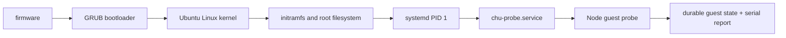

# CHU VM OS substrate

2026-10-01 · `SECONDARY_AI` implementation design. The user-required target is a
CHU OS that **boots in a virtual machine and can run HSWM**. The exact user
statement is preserved in [`canon/sources/USER_PRIMARY_VM_OS_HSWM_2026-09-30.txt`](../canon/sources/USER_PRIMARY_VM_OS_HSWM_2026-09-30.txt).
This directory contains a checksum-pinned first substrate experiment. It has not
met that target or demonstrated bit-for-bit reproducible OS image builds.

## What exists now

On 2026-10-01, both cold boots and clean shutdowns passed in 346 seconds total:
[`boot-verification.json`](boot-verification.json),
[`PROV evidence`](boot-evidence.ttl), and
[`source extraction digests`](source-review.json).
The second boot's previous-state digest matches the first boot's saved state.
These are local execution observations; normal CI checks the harness without
booting this Debian-specific VM profile. Original serial logs remain in the
ignored run directory named in the report.

On 2026-10-02 the harness gained offline input-lock structure validation and
direct Ubuntu image byte-CID recording for future runs. The archived report and
PROV above are unchanged: they omit the direct image CID, and their runner source
digest no longer matches the current harness. No new VM boot was performed for
that change. `./chu repo query evidence --json` distinguishes changed tracked
sources from matching guest payloads and unavailable ignored inputs.

`scripts/chu_vm.py` obtains checksum-pinned host tools, an Ubuntu 24.04 image,
and Node; it builds a fresh cloud-init seed and starts QEMU with TCG, a serial
console, and `-nic none`. The guest service checks the following before it emits
one nonce-bound report and powers off:



The probe requires Ubuntu, systemd as PID 1, cgroup v2, Node `v24.13.0`, and an
atomic durable state update. It deliberately reports `hswm: NOT_READY`: it does
not package, import, or execute HSWM, does not configure a model provider, and
does not expose a guest network. A successful VM substrate run proves only this
listed contract.

The kernel is currently reused as an implementation proposal, with Ubuntu's
root filesystem and systemd as the first boot environment. It is **not** a
user-ratified decision to forgo a CHU kernel. A new-kernel path remains an open
architecture decision in [`canon/VM_OS_TARGET.md`](../canon/VM_OS_TARGET.md).

## Reproduce and inspect evidence

Use the project environment after the normal bootstrap:

```bash
./chu vm bootstrap --json
./chu vm doctor --json
./chu vm sources --json
./chu vm boot --timeout 450 --json
```

`bootstrap` downloads only artifacts listed in [`inputs.lock.json`](inputs.lock.json)
and verifies their SHA-256 values. The installed QEMU is private under `.chu/os`;
no system package installation, KVM access, host network forwarding, or guest
network access is required. `boot` makes an ephemeral qcow2 overlay and seed in
`.chu/os/runs/<nonce>/`; its JSON report, serial logs, and PROV evidence are the
result. A timeout or nonzero report is a failed experiment, not a partial pass.

The first offline boot can spend 120 seconds in the base image's `wait-online`
job. Guest setup disables that wait for later boots. A clean two-boot result
must still produce a new valid report before the previous-state SHA-256 chain is
accepted; this is a clean-shutdown check, not a crash or power-loss recovery
claim. The current boot verdict remains in its run evidence.

## Source review and guest boundary

| Component | Reviewed pinned source | Actual guest observation | Boundary |
|---|---|---|---|
| Linux | Ubuntu GA `6.8.0-31.31`: `init/main.c` (`rest_init` 684, `kernel_init` 1432, `/init`/fallback 1466/1497), `do_mounts.c` (`prepare_namespace` 462), `initramfs.c` (`do_populate_rootfs` 700) | `6.8.0-139-generic` | Guest kernel is later than the reviewed GA source; no binary audit or kernel rebuild claim. |
| systemd | upstream `v255`, `src/core/main.c` | Ubuntu `255.4` with patches | Source trace is not an Ubuntu package equivalence claim. |
| cloud-init | Canonical `26.2`, `DataSourceNoCloud.py` | Ubuntu `26.1` with patches | Confirms the selected NoCloud mechanism only; no full cloud-init audit. |

The `sources` command extracts selected artifacts and records their byte digests.
That is focused source tracing, not a full Ubuntu or Linux-kernel audit.
Ubuntu's source acquisition guidance is at
[Ubuntu kernel source](https://ubuntu.com/kernel/docs/how-to/source-code/obtain-kernel-source-git/);
the Linux boot entry is [`init/main.c`](https://git.kernel.org/pub/scm/linux/kernel/git/torvalds/linux.git/tree/init/main.c)
and mounting transition is [`init/do_mounts.c`](https://git.kernel.org/pub/scm/linux/kernel/git/torvalds/linux.git/tree/init/do_mounts.c).

HSWM was inspected at checkout HEAD `a7272a13cd6d304b7f8a1911dca0158e0bc67f29`,
without running it. The observed **uncommitted working-tree**
`src/hswm/effect-runtime/package.json` has digest
`f6854b3e0098f010bdc7d1cd78d9722b949124de15228885b83e46b942dd09b4`.
The [committed package](https://github.com/gj3447/HSWM/blob/a7272a13cd6d304b7f8a1911dca0158e0bc67f29/src/hswm/effect-runtime/package.json)
has the same Node/npm requirements, but is not byte-identical to that observation;
the [implementable architecture at the same revision](https://github.com/gj3447/HSWM/blob/a7272a13cd6d304b7f8a1911dca0158e0bc67f29/docs/research/HSWM_IMPLEMENTABLE_ARCHITECTURE_2026-09-27.md)
is unmodified and has digest `afd800d56c27b8536adc245669433e24cbaf9f5453e4f9f23079ccebef4f2c77`.
The host tool profile deliberately supports Debian 13 x86_64 only until an
alternative ABI is explicitly verified.

HSWM's active path is TypeScript/Effect on Node `24.13.0` and npm `11.6.2`, with
the package's declared dependencies and its POSIX content/journal state. A chosen
model provider is also a required deployment input. Postgres, Neo4j, and Temporal
are path-dependent integrations, not blanket prerequisites for every HSWM run.
The Python research and comparison path is separate; it is needed only when that
chosen workload or verification command uses Python.

## Required path to a CHU OS capable of HSWM

CHU OS acceptance requires all of: a reproducible image build, an update and
rollback path, a verified boot and recovery contract, guest capability
enforcement, a persistent CHU graph service with a rewrite boundary, and HSWM's
declared runtime, chosen provider, and guest adapter producing a verified result.
Credentials and resource transport remain explicit deployment inputs, never
implicit image contents. The exact prerequisite graph is maintained in
[`plan/chu_os_plan.graph.json`](../plan/chu_os_plan.graph.json), particularly
T60–T69. T66–T68 cover image construction, update/rollback and crash recovery;
T69 requires their evidence together with the guest graph and HSWM results.

## Research and requirements trace

The [2026-10-02 research](../research/OS_BUILD_RESEARCH_2026-10-02.md) compares
mkosi, Buildroot, Yocto, LFS and kernel-development paths. Linux reuse with a
mkosi image experiment is a `SECONDARY_AI` proposal, not an adopted toolchain.

[`design.ttl`](design.ttl) connects seven normalized requirements, the proposed
experiment and alternatives, plan tasks, primary-source byte CIDs, and one
bounded historical observation. [`ontology.ttl`](ontology.ttl) defines the
local predicates; [`design-shapes.ttl`](design-shapes.ttl) constrains their use.
Requirement/decision IRIs identify engineering concepts; artifact IRIs identify
file bytes. `pathView` is a repo-relative representation, not identity.
Only the three local source artifacts are byte-verified. External URLs are dated
web citations, not archived or hash-verified content; implementation selection
must pin its actual inputs. The D04 identifier is the existing RDF subject in
`research/linux_os/findings.ttl`, not an HTTP retrieval URL.

```bash
./chu check --only os-design --json
```

This check projects task status from the canonical JSON plan, validates SHACL,
predicate domains/ranges and cited byte CIDs, then compares three SPARQL queries
with RDFLib and Oxigraph. The retained `os-design-answers.json` answers:

- Which source supports each requirement, which task covers it, and is it done?
- Which strategy is proposed, by whose authority, with which alternatives and sources?
- What exactly does the archived experiment support, and at what original time?

The old overlay-only research decision D04 is preserved in its archive and
explicitly superseded in the current design view. The current graph cannot
promote a proposal to a user decision or the clean-boot observation to OS/HSWM
completion. Tests exercise those invalid claims.

Remaining gaps: boot evidence still stores detailed results in a JSON literal,
not individual typed boot/input-role nodes; the plan's older completion records
do not all have digest-bound evidence; HSWM packaging and the release/update/
recovery activities are still unimplemented. This check reads archived evidence
and does not rerun a VM, validate unavailable serial logs, or execute HSWM.
