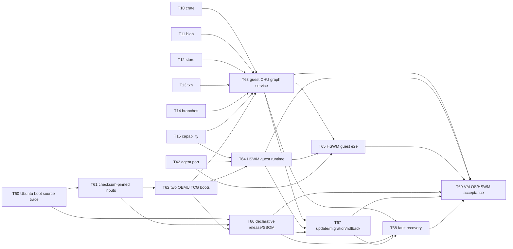
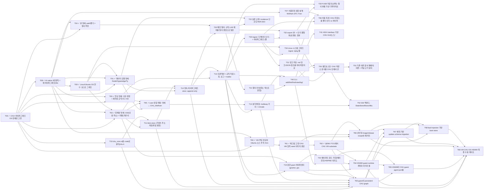

# CHU OS 작업계획 (그래프 엔지니어링)

> **정체성**: CHU = 하이퍼그래프 기반 OS. 폴더 트리 없음 — 모든 것은 노드 + n-ary 하이퍼엣지이고,
> 경로/폴더는 질의로 만든 뷰다. (정전: [`../AGENTS.md`](../AGENTS.md))
>
> **정본 = [`chu_os_plan.graph.json`](chu_os_plan.graph.json)**. 이 문서는 그 그래프의 사람용 뷰다.
> 계획 자체도 하이퍼그래프(B-graph): 하이퍼엣지의 tail이 **전부** 끝나야 head를 착수한다.
> 검증: `python3 plan/check_plan.py` (참조 무결성 · 비순환 · 고아 노드 · 임계 경로).
>
> **토대**: [AI native 3대원칙](../canon/AI_NATIVE_THREE_PRINCIPLES.md) ·
> [왜 하이퍼그래프인가 (Wolfram·ZFC·Transformer·HSWM)](../WHY_HYPERGRAPH.md).

---

## 실행 명세 — 2026-09-30

[구현 순서와 검증 계약](../spec/ARCHITECTURE.md)을 먼저 읽는다.
T01–T05의 데이터·정체성·연산·뷰·Lean 매핑 문서를 작성하고 실제 5종 파일로
내용 주소, 다중 소속, 원자적 변경, 두 분기, RDF 왕복과 독립 SPARQL 결과를 검증한다.
`./chu model demo --json`, `./chu model roadmap --json`, `./chu check --only kernel-contract --json`.
참조 모델은 메모리 실행 명세다. T10–T15 영속 Rust 커널은 여전히 후속 구현이며,
현재 착수 가능한 작업은 T07(연구), T10(Rust 라이브러리 분리), T66(선언형 release
recipe)다.

2026-10-01: T60–T62의 소스 추적·고정 입력 생성·실제 두 번의 VM 부팅을 완료했다.
[측정 결과](../os/boot-verification.json)는 정상 종료 후 상태 해시 연쇄까지 확인한다.
T63–T69의 guest 그래프 서비스·HSWM 연결·release/rollback·fault recovery·최종
수용 게이트는 미완료다. T61의 체크섬 고정 입력은 재현 가능한 *입력* 증거이지,
bit-identical guest image 재빌드 증거가 아니다.

2026-09-30 사용자 발언에 따라 목표는 **VM에서 부팅하고 HSWM을 실행할 수 있는 CHU OS**다.
과거 Linux 연구의 사용자 공간 오버레이(D04)는 이 목표의 범위 결정을 대신하지 않는다.
T60–T69는 부팅, guest graph service, HSWM runtime, 실제 adapter 실행, 선언형 release,
update/rollback, fault recovery, 최종 수용을 분리한 M7 게이트다. 현 VM 구현은 substrate
probe이며 HSWM을 실행하지 않는다. 입력·증거·정확한
부팅 계약은 [`../os/README.md`](../os/README.md)에 있다.

2026-10-07: 사용자는 CHU OS의 GUI를 **HOH Interface**로 만들자는 의견을 제시했다
([원문](../canon/sources/USER_PRIMARY_CHU_HOH_GUI_2026-10-07.txt)). 기존 T41을
HOH 셸과 CHU 호스트 어댑터를 연결하는 작업으로 구체화했다.
[연결 설계와 수용 조건](../spec/ARCHITECTURE.md#gui-방향--hoh-interface-2026-10-07)은
AI 작성 제안이며, 구현 상태는 여전히 **pending**이다.

## 1. 목표 아키텍처 (레이어 = 노드 속성 `layer`)

| 레이어 | 역할 | 기존 자산 재사용 |
|---|---|---|
| spec | 데이터 모델·정체성·연산·뷰 명세 | `axiom CHU : Type`, JaebaeMan, `CHU_WolframRewrite.lean` |
| kernel | 콘텐츠 주소 store, 트랜잭션 = 재작성 규칙, 이력 = multiway | `chu_core.rs` (HyperState, Rule, 4 포트, UnivalentStateStore) |
| query | 하이퍼엣지 패턴 질의 → 뷰 | `chu_core.rs` 규칙 LHS 매처 |
| compat | 트리 ingest/export, FUSE 가상 디렉터리 | — (트리는 호환 뷰일 뿐, 정본 아님) |
| shell | CLI · HOH Interface 기반 그래프 작업공간 GUI · 에이전트 포트 | HOH 공통 UI 셸, HSPINE (의지/권한도 노드로) |
| dogfood/dist | CHU 저장소를 CHU 안에서 운영, 333 분산 백엔드 | `333_ADAPTER_CONTRACT.md` |

설계 불변식:
1. **I-노드**: 정체성은 CID(내용). 이름·경로는 가변 라벨/뷰.
2. **I-다중소속**: 한 노드는 임의 개수의 그룹 하이퍼엣지에 속한다. 단일 부모 강제 금지.
3. **I-규칙**: 모든 변경은 `H₁→H₂` 재작성 1회 = 트랜잭션 1회. 이력은 버리지 않는다(multiway).
4. **I-최소공리**: Lean 쪽 신규 axiom 0 (기존 I1 유지).
5. **I-3대원칙**: ① 층 변환 M = Map이 1급 연산 · ② 표현 단위 = n항 역할 하이퍼엣지, 저장 형식은 비용 측정으로 선택 ·
   ③ LLM = ROM(실행 단위), CHU 그래프 = 메모리, Semantic Weight = 프로그램.

## 2. 마일스톤

| M | 이름 | 종료 조건 (게이트) | effort |
|---|---|---|---|
| M0 ✓ | 정체성 고정 + 3대원칙 수입 | AGENTS.md 정전, 3대원칙·WHY_HYPERGRAPH, CHU Lean 11개 수입·재검증 | 1.5일 |
| M1 | 명세 + Linux 연구 | T01–T05 명세·참조 검증 ✓, 신규 axiom 추가 0; T07 미완료, Linux OS 연구 ✓(T09) | 10.5일 |
| M2 | 커널 | 영속 store + txn + 분기 + 권한 grant(T15), `cargo test` green | 13일 |
| M3 | 질의 | 패턴 질의 + 최소 문법 + RDF/SHACL 표준 교환(T22), 골든 테스트 | 6일 |
| M4 | 호환 | CHU 저장소 ingest→export 왕복 diff 0, FUSE(선택), Linux 시스템 그래프 ingest(T34), 트리 vs 하이퍼그래프 비용 측정(T06) | 13일 |
| M5 | 셸 | CLI e2e, UI·에이전트가 같은 txn 로그 생성 | 8일 |
| M6 | 셀프호스팅/분산 | 이 계획 그래프까지 CHU 노드로 적재, 333 2-피어 동기화 | 8일 |
| M7 | VM OS / HSWM | Ubuntu source trace → checksum-pinned inputs → 2회 QEMU boot → release recipe/SBOM → guest graph service → HSWM runtime·e2e → update/rollback → fault recovery → final acceptance | 32일 |

총 92 작업일(추정, 완료 15일 / 남은 77일; 완료 노드 11개). **전체 의존 경로의 임계 길이 31.5일**
(완료 작업을 포함한 추정이며 납기 확약 아님):
`T00 → T08 → T09 → T02 → T11 → T12 → T20 → T21 → T40 → T42 → T64 → T67 → T68 → T69`

## 3. 위상 레이어 (같은 줄 = 병렬 가능)

```
L0: T00
L1: T08, T10
L2: T03, T04, T07, T09, T60
L3: T01, T02, T61
L4: T05, T11, T62
L5: T12, T66
L6: T13, T20
L7: T14, T15, T21, T22, T30
L8: T31, T32, T34, T40, T63
L9: T06, T33, T41, T42, T50
L10: T51, T52, T64
L11: T65, T67
L12: T68
L13: T69
```

VM OS 경로는 기존 그래프 커널과 합류한다.



T62는 HSWM 실행 완료가 아니다. T65의 guest transaction·result CID·capability 거부
증거가 있어야 HSWM workload를 CHU guest에서 실행했다고 말할 수 있다. T69는 T63–T68
모두의 evidence가 같은 release에 결합된 뒤에만 complete VM CHU OS/HSWM 수용을 허용한다.

## 4. 의존 하이퍼그래프

`python3 plan/check_plan.py --mermaid`로 재생성.



## 5. 운영 규칙 (표준 그래프 엔지니어링)

- **그래프가 정본**: 작업 추가·변경은 JSON을 먼저 고치고 `check_plan.py`가 OK일 때만 커밋.
- **노드 = 검증 가능한 산출물**: 모든 노드는 `deliverable`과 `verify`를 가진다. 검증 없는 노드는 금지.
- **하이퍼엣지 = 합류 조건**: 여러 선행이 함께 필요하면 이진 엣지 여러 개가 아니라 tail 집합 하나로 적는다.
- **임계 경로 우선**: 착수 순서는 임계 경로 노드 → 같은 레이어의 나머지.
- **재계획 = 재작성**: 계획 변경도 그래프 재작성으로 보고, 이유를 커밋 메시지에 남긴다.

## 6. 열린 결정

- OS 목표: VM에서 부팅하고 HSWM을 실행 가능한 CHU OS(사용자 결정). Linux 커널 재사용으로
  시작할지 자체 커널을 구현할지는 아직 미확정이며, 현재 구현은 전자에 대한 `SECONDARY_AI`
  제안이다.
- 영속 백엔드: 자체 append-only 로그(현재 가정) vs SQLite/RocksDB 같은 임베디드 DB 위에 구현.
- 정본 소유: SYMPOSIUM/THEORY/CHU와 이 저장소 중 어느 쪽이 정본인지 (Provenance 참조).
