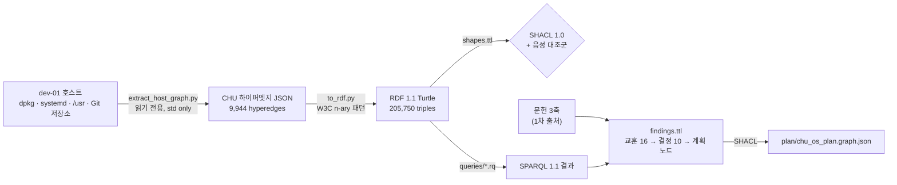

# Linux/Ubuntu OS 연구 — 하이퍼그래프 OS로 가는 길

2026-09-29 · 계획 노드 **T09** (완료) · `SECONDARY_AI_RESEARCH` — 사용자 방향(CHU = 하이퍼그래프 OS)에 대한 AI의 조사·실측

**질문:** Linux(Ubuntu/Debian)는 이미 어떤 그래프·하이퍼그래프를 품고 있고, CHU 하이퍼그래프 OS는 그 위에
무엇을 가져오고, 무엇을 피하고, 어떻게 올라가야 하는가?

**결론 한 줄:** Linux는 이미 "정체성 ≠ 이름", "폴더 = 다중 소속 그룹", "n항 대안 관계"를 안에 품고 있다.
CHU는 **Linux를 대체하지 않고 사용자 공간 오버레이로** 올라가, 그 숨은 하이퍼그래프를 1급으로 만든다.

---

## 1. 방법 — 표준 그래프 엔지니어링



| 단계 | 파일 | 표준 |
|---|---|---|
| 추출 | [`linux_os/extract_host_graph.py`](linux_os/extract_host_graph.py) | CHU 하이퍼엣지 `{type, participants[{role,node}]}` |
| 변환 | [`linux_os/to_rdf.py`](linux_os/to_rdf.py) | RDF 1.1, [W3C N-ary Relations](https://www.w3.org/TR/swbp-n-aryRelations/) (relation node + role incidence), PROV-O |
| 검증 | [`linux_os/shapes.ttl`](linux_os/shapes.ttl) | SHACL 1.0 + SHACL-SPARQL target (arity = incidence 수) |
| 질의 | [`linux_os/queries/`](linux_os/queries/) | SPARQL 1.1 |
| 지식 그래프 | [`linux_os/findings_graph.py`](linux_os/findings_graph.py) → [`findings.ttl`](linux_os/findings.ttl) | RDF + PROV-O `wasDerivedFrom` + SHACL |

재현:

```sh
python3 research/linux_os/extract_host_graph.py --content-root ../CHU --content-root ../HSWM --content-root ../USL
uv run --with rdflib --with pyshacl python research/linux_os/to_rdf.py        # ~2.5분
uv run --with rdflib --with pyshacl python research/linux_os/findings_graph.py
```

전체 호스트 그래프(`out/`)는 설치 패키지·서비스 인벤토리이므로 **Git에서 제외**하고, 이름 없는 집계만
[`public_summary.json`](linux_os/public_summary.json)으로 커밋한다.

**검증 결과:** SHACL 적합 · 음성 대조군(arity 불일치·role 누락) 거부 확인. SHACL이 첫 실행에서
**실제 버그를 잡았다** — 공동 소유 하이퍼엣지가 등록되지 않은 패키지 노드를 참조(dangling). 수정 후 dangling 0.

## 2. 호스트 사실 (주의)

- dev-01은 **Ubuntu가 아니라 Proxmox LXC 안의 Debian 13 (trixie)**, 커널 7.0 PVE. Ubuntu와 dpkg·apt·systemd는
  같으므로 실측은 Ubuntu에도 적용되지만, snap·Ubuntu Core는 문헌으로만 다뤘다.
- **`/dev/fuse` 없음** (LXC). user namespace·`user.` xattr은 동작.

## 3. 실측 — Linux 안의 숨은 하이퍼그래프

| 관계 | 하이퍼엣지 | 최대 arity | 평균 | 의미 |
|---|---:|---:|---:|---|
| dpkg 공동 소유 경로 | 593 | **1,005** | 22.0 | 591/593이 디렉터리 — **폴더는 이미 다중 소속 그룹 하이퍼엣지** |
| 내용 중복 (CHU·HSWM·USL) | 130 | 37 | 5.3 | 사본 434개·1.83 MB, 저장소 간 7건(LICENSE·사용자 원문) — **트리는 사본을, CID는 노드 1개를** |
| dpkg Depends | 2,811 | 9 | 2.02 | `a \| b` 대안 |
| dpkg Recommends / Suggests | 193 / 357 | 9 | 2.2 / 2.1 | 대안 |
| 하드링크 (/usr) | 5 | 3 | 3.0 | 한 inode 여러 이름 |
| dpkg Breaks/Conflicts/Provides | 779/106/1,494 | 2 | 2.0 | 이항 |
| systemd (Requires·Wants·After·Before·…) | 3,362 | 2 | 2.0 | **전부 이항** (대조군) |

- **n항 대안 절:** 관계 절 4,360개 중 80개(1.8%)가 대안 ≥2, 최대 대안 8개. 비율은 작지만 **이항으로 쪼개면 의미가
  깨진다**(“이 중 하나”) — CNF 절 구조.
- **다중 소속:** 패키지 하나가 최대 593개 하이퍼엣지에, systemd 유닛 하나가 최대 514개에 동시에 참여(트리는 부모 1).

## 4. 문헌 3축 요약

### A. 트리를 넘는 파일시스템·이름
- VFS는 inode(대상)와 dentry/path(이름)를 이미 분리한다 ([kernel VFS](https://docs.kernel.org/filesystems/vfs.html)). 그러나 inode 정체성은
  파일시스템 국소·복사 불생존, `open_by_handle_at`은 특권 필요·재부팅 비영속 ([man](https://man7.org/linux/man-pages/man2/open_by_handle_at.2.html)).
- 디렉터리 하드링크 금지 = 순환·fsck·`..` 문제 ([link(2)](https://man7.org/linux/man-pages/man2/link.2.html)).
- xattr은 ext4에서 파일당 한 블록(보통 4 KiB) — 하이퍼엣지 저장소로 부적합, CID 꼬리표 정도만 ([xattr(7)](https://man7.org/linux/man-pages/man7/xattr.7.html)).
- 시맨틱 FS의 교훈: Gifford SFS(1991) 가상 디렉터리 = 질의, BeFS 라이브 질의, **WinFS 취소**(“관계형 엔진을 파일시스템처럼 동작·성능” 실패,
  [MS](https://learn.microsoft.com/en-us/archive/blogs/winfs/update-to-the-update)), **Nepomuk→Baloo**(“거대한 중앙 저장소가 제약, RDF는 더 어렵게”,
  [LWN](https://lwn.net/Articles/637195/)), GNOME Tracker → TinySPARQL(SPARQL 1.1 RDF 저장소는 살아 있음).
- 내용 주소·분기: Git Merkle DAG, OSTree(“OS 바이너리용 git”), Nix(CA derivation은 아직 실험적), IPFS(인코딩 따라 같은 내용이 다른 CID),
  Btrfs/ZFS(분기는 있으나 CID·merge 없음).
- Plan 9 프로세스별 네임스페이스 = “경로는 뷰”의 직접 선례 ([names](https://9p.io/sys/doc/names.html)).

### B. Ubuntu/Linux 안의 시스템 그래프·권한
- systemd: 요구 관계와 순서 관계는 **별개 그래프**, 모든 지시문은 이항으로 전개, transaction은 원자적 job 집합 ([systemd.unit(5)](https://man7.org/linux/man-pages/man5/systemd.unit.5.html)).
- Debian 정책: `Depends: a | b` = 버전 리터럴의 CNF 절 = **기존 OS에서 가장 선명한 n항 하이퍼엣지** ([Policy §7](https://www.debian.org/doc/debian-policy/ch-relationships.html)). apt 3.0 solver3의 함의 그래프는 `apt why` 설명 그래프.
- **snap plug/slot/interface** = 역할 있는 명시적·철회 가능한 연결 — CHU 하이퍼엣지+권한에 가장 가까운 기존 모델(만료만 없음, [snapcraft](https://snapcraft.io/docs/explanation/interfaces/all-about-interfaces/)).
- 권한 원시요소 중 **만료+철회 둘 다** 있는 것은 sudoers `NOTAFTER`·polkit 임시 인가뿐. Landlock/seccomp는 **추가만 가능, 해제 불가** → 철회 = 프로세스 트리 종료 ([Landlock](https://docs.kernel.org/userspace-api/landlock.html), [systemd-run](https://man7.org/linux/man-pages/man1/systemd-run.1.html)).
- cgroup v2 하위 트리의 `cgroup.freeze`/`cgroup.kill` = 작업 세션 단위 봉쇄·철회 ([cgroup-v2](https://docs.kernel.org/admin-guide/cgroup-v2.html)).

### C. 그래프·하이퍼그래프 네이티브 시스템
- **OpenCog Hyperon**(AtomSpace/DAS + MeTTa): 같은 비전, 2026-09 기준 여전히 0.2.x — 커널을 작게.
- **Unison 1.0**(2025-11): 해시 = 정체성, 이름 = 메타데이터. **TypeDB 3.x**: 역할 이름 n항 관계 + 스키마 — CHU 하이퍼엣지와 가장 가까운 데이터 모델.
- **능력 OS:** seL4 파생 트리 Revoke, Fuchsia use/offer/expose 라우팅, Genode 부모 라우팅 → “명시적·범위·철회” 권한의 형식.
- **DB-as-OS의 운명:** DBOS는 OS가 아니라 Postgres 위 라이브러리로 살아남음, Urbit 소규모, WinFS 취소, Fuchsia 범용화 후퇴.
- **재작성 엔진:** GP2 rooted rule(상수 시간 매칭), MORK trie zipper, SetReplace(multiway 참조 구현, 생산 커널은 아님), Dolt 2.0(분기 이력 + GC 필요).
- 표준: 하이퍼그래프 표준은 없다 — RDF 1.2 triple term(CR), GQL(ISO/IEC 39075:2024, 이항), **incidence 인코딩**이 교환 형식.

## 5. 설계 결정 (D01–D10) → 계획

지식 그래프: [`linux_os/findings.ttl`](linux_os/findings.ttl) (교훈 L01–L16 → 결정 → 계획 노드, SHACL 적합).

| 결정 | 내용 | 계획 |
|---|---|---|
| D01 | 정체성 = CHU CID. inode·경로는 표현으로 바인딩 | T02 |
| D02 | 폴더 = 그룹 하이퍼엣지(다중 소속). FS 링크로 흉내 금지, 경로 뷰는 비순환 | T01, T04 |
| D03 | 관계 = 역할 있는 절. OR 대안 집합을 1급으로, 의미가 다른 관계(요구/순서)는 분리 | T01, T03 |
| D04 | **Linux 위 사용자 공간 오버레이/라이브러리로 시작.** blob은 일반 도구로 읽히게, 색인은 재구축 가능 | T11, T12 |
| D05 | 경로 뷰는 daemon/API 먼저, **FUSE는 선택**(LXC는 호스트/VM에서). 뷰 지연 측정 | T33, T40 |
| D06 | CID 인코딩 고정(sha256 raw) + **안정 노드 ID / 버전 CID 분리**, 이름 = 가변 포인터 | T02, T11 |
| D07 | Git식 Merkle 객체 + 추가 전용 로그, multiway 가지치기·GC 처음부터 | T12–T14 |
| D08 | **권한 = grant 하이퍼엣지** `{grantor, grantee, capability, scope, not_after, derived_from}`, 집행 = systemd transient unit + Landlock, 철회 = unit 정지·cgroup.kill + 파생 연쇄 — [Covenant](https://github.com/gj3447/metahumotonic-foundation/pull/1) L0–L4와 대응 | **T15 신규** |
| D09 | 타입 스키마 + incidence 인코딩 표준 교환(RDF/JSON-LD+SHACL → RDF 1.2·GQL) | T01, **T22 신규** |
| D10 | 재작성·질의는 국소성 제한 + 선택도 높은 조건 먼저 (실측: SPARQL 370초 → 수 초) | T13, T20 |

추가 노드 **T34**: Linux 시스템 그래프 ingest(이번 추출기를 커널 ingest로 승격). 계획 총 60일, 남은 56.5일, 임계 경로 23.5일.

## 6. 경계와 한계

- 실측은 **한 호스트**(Debian 13 LXC) 스냅숏이다. Ubuntu 데스크톱·서버의 수치는 다를 수 있다.
- 내용 중복 측정은 CHU·HSWM·USL의 Git tracked 파일에 한정한다. 트리 대비 하이퍼그래프의 **전체 비용**(원칙 ②)은 T06에서 측정한다.
- 문헌 요약 중 조사 에이전트가 **확인하지 못했다고 보고한 항목**: systemd 문서는 freedesktop.org 403으로 man7.org 사본 사용,
  `systemd-creds --not-after` 존재, Landlock ABI v8–v11 세부, Btrfs/ZFS merge 부재의 1차 출처, MORK 라이선스(LICENSE 파일 없음),
  Unison 라이선스(GitHub NOASSERTION), DAS 생산 성숙도, Dolt 성능 주장(벤더). 이 항목들은 결정의 단독 근거로 쓰지 않았다.
