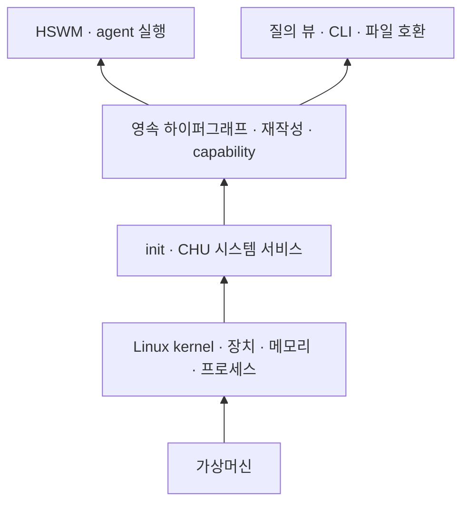

# CHU OS를 실제로 만드는 경로 조사

2026-10-02 · `SECONDARY_AI_RESEARCH` · 1차 출처 검토. 사용자 목표는 VM에서
부팅하고 HSWM을 실행할 수 있는 CHU OS다. 현재 저장소는 Ubuntu/QEMU substrate와
guest probe까지만 있으며, **CHU OS나 HSWM 실행은 아직 완료되지 않았다.**

## 먼저 만들어야 하는 여섯 계층

1. VM firmware와 bootloader
2. Linux kernel과 initramfs
3. root filesystem와 init/service manager
4. persistent CHU graph store·rewrite transaction·capability service
5. HSWM runtime, 모델 제공자 설정, CHU adapter
6. 이미지 build·서명/입력 고정·update·rollback·crash recovery 수명주기

앞의 세 계층을 부팅했다고 뒤의 세 계층이 생기지는 않는다. 특히 HSWM의 현재 경로는
Node 24/POSIX journal을 전제로 하므로 이미지가 그 ABI와 의존성을 제공하는지, provider
권한과 CHU transaction 경계를 실제로 통과하는지를 별도로 검증해야 한다.

CHU가 소유할 핵심은 **CID로 식별되는 내용, 역할·순서가 있는 n항 관계, 원자적 재작성,
분기 이력, 권한 집행**이다. 파일 경로와 폴더는 이 그래프를 질의한 호환용 뷰다.
Linux의 VFS를 사용하더라도 그것을 CHU 정체성의 정본으로 삼지는 않는다.
HSWM과 다른 agent는 같은 capability/transaction 경계를 통해 작업과 결과를 남겨야 한다.
이 내용은 사용자 정전을 바탕으로 한 구현 해석이며 현재 구현 완료를 뜻하지 않는다.
[정전](../canon/sources/USER_PRIMARY_CHU_HYPERGRAPH_OS_2026-09-29.txt),
[실행 명세와 현재 한계](../spec/ARCHITECTURE.md).

위 그림은 Linux 재사용 경로의 제안이다. 이미지 생성과 update/rollback/recovery는
그 전체를 버전별로 관리하는 별도 수명주기다.

## 이미지 제작 경로 비교

| 경로 | 실제로 만드는 것 | CHU/HSWM 적합성 및 한계 |
|---|---|---|
| Ubuntu + **mkosi** | `apt` 등을 감싼 systemd 계열 image builder. disk image, initrd, UKI, rootfs, sysext 등을 만들 수 있다. | 현재 Ubuntu/systemd/QEMU와 가장 가까운 다음 실험 후보다. Node/POSIX HSWM은 Debian/Ubuntu package·서비스로 넣을 수 있다는 **추론**이지만, HSWM 빌드·실행을 증명하지 않는다. update/rollback 정책은 별도 설계해야 한다. [mkosi](https://mkosi.systemd.io/), [systemd image components](https://systemd.io/ROOTFS_DISCOVERY/), [safe image rules](https://systemd.io/BUILDING_IMAGES/) |
| Buildroot | cross toolchain, 선택 package, Linux kernel, bootloader, rootfs image를 생성한다. | 작은 appliance·Linux kernel 구성 제어에 적합하다. Node 24/HSWM은 target package·cross-build·journal ABI를 검증해야 한다. CHU graph나 application rollback을 제공하지 않는다. [manual](https://buildroot.org/downloads/manual/manual.html) |
| Yocto/OpenEmbedded | 여러 hardware와 software stack용 custom Linux image와 layer 기반 build 환경을 제공한다. | 보드·제품군·SBOM/공급망 규모가 커질 때 후보다. 입력이 같으면 binary도 같아야 한다는 재현성 테스트와 build history가 강점이지만, HSWM recipe와 update mechanism은 별도다. [overview](https://docs.yoctoproject.org/current/overview-manual/yp-intro.html), [reproducible builds](https://docs.yoctoproject.org/current/test-manual/reproducible-builds.html), [build history](https://docs.yoctoproject.org/current/dev-manual/build-quality.html) |
| Linux From Scratch | host → cross toolchain → chroot → base system → Linux kernel/bootloader를 소스에서 조립하는 학습·기초 구축 경로다. | Linux 시스템이 구성되는 과정을 배우는 자료다. 새 커널을 작성하는 과정과는 구별하며, CHU release·rollback·HSWM 수명주기는 추가 구현 대상이다. 유지되는 systemd stable book을 기준으로 본다. [LFS stable systemd](https://www.linuxfromscratch.org/lfs/view/stable-systemd/) |
| xv6 / seL4 / 자체 kernel | xv6는 교육용 Unix 계열 OS, seL4는 microkernel이다. 자체 kernel 작성 시 이들을 설계 참고 자료로 검토할 수 있다. | 자체 kernel 경로에서는 boot·memory·scheduler·driver·process·파일 API 구현을 책임져야 한다. seL4를 재사용해도 사용자 공간 서비스와 HSWM 실행환경은 추가해야 한다. [xv6](https://pdos.csail.mit.edu/6.1810/2025/xv6.html), [seL4](https://docs.sel4.systems/projects/sel4/) |

보조 경로로 Debian `live-build`는 live ISO/HDD/netboot와 package/hook 구성을 제공한다.
Ubuntu Core의 `ubuntu-image`는 model assertion에서 bootable snap image를 만들며, Core는
transactional update와 rollback을 제공한다. 둘 다 유효하지만, 전자는 live-media 성격이고
후자는 snap/gadget/kernel model 채택이 필요하므로 현재 apt 기반 substrate의 직결 대체물은
아니다. [Debian Live manual](https://live-team.pages.debian.net/live-manual/html/live-manual/index.en.html),
[Ubuntu Core image creation](https://documentation.ubuntu.com/core/how-to-guides/image-creation/),
[Ubuntu Core lifecycle](https://documentation.ubuntu.com/core/).

## 제안과 다음 검증 순서

다음은 사용자 결정이 아닌 `SECONDARY_AI_PROPOSED`다. Linux reuse를 유지하고, 부팅이
안정된 뒤 mkosi recipe로 input lock→image digest→QEMU test를 한 단위로 만드는 실험을
우선 제안한다. 현재 substrate를 활용할 수 있다는 판단이며, 다른 경로와 제작 시간을
실측 비교한 결과는 아니다. LFS는 Linux 조립 학습에, xv6/seL4는 커널 설계 연구에 쓴다.
자체 kernel 구현 여부는 열린 선택으로 남긴다. Node의 지원 플랫폼과 libc 조건을 고려하면
새 커널에서 현재 HSWM을 돌리려면 해당 실행환경 구현 또는 포팅이 필요하다는 **추론**이다.
[Node 24.13 build/platform contract](https://github.com/nodejs/node/blob/v24.13.0/BUILDING.md).

1. **T66**: image/release recipe와 입력 lock·image digest·QEMU boot evidence를 만든다. mkosi는 실험 후보이며 아직 설치·채택하지 않았다.
2. **T63**: guest persistent CHU graph service와 capability 경계를 만든다.
3. **T64**: HSWM Node/Effect runtime과 선언된 provider contract를 guest에 넣는다.
4. **T67**: candidate image update와 rollback을 graph state 보존 조건으로 시험한다.
5. **T68**: write 중단·전원 상실을 포함한 crash recovery를 시험한다.
6. **T65**: HSWM workload가 guest CHU transaction/result CID를 남기는지 시험한다.
7. **T69**: 위 증거와 release provenance를 묶어 최종 acceptance를 판정한다.

현재 clean boot 증거가 있더라도 crash recovery도, bit-for-bit reproducible image build도
아니다. 두 성질은 T68과 T66/T67의 별도 gate다.

## 표준 그래프 엔지니어링 적용 감사

현재 CHU는 data/rewrite/projection 명세와 개발 도구의 RDF·SHACL·PROV 검증은 비교적
갖췄다. 반면 OS 요구사항과 image/release evidence는 부분적이며, boot run이 recovery,
rollback, reproducibility 또는 HSWM 실행까지 보장하지 않는다. 하이퍼그래프 OS 전체를
완결하는 단일 공개 표준은 확인하지 못했다. RDF/SHACL/PROV는 교환·검증·provenance 도구이지
OS kernel이나 hypergraph storage 표준이 아니다.

따라서 graph에는 경로를 정체성으로 저장하지 말고, input artifact CID, image CID, build
activity, boot observation, update candidate, rollback result, HSWM workload를 분리한다.
다항 acceptance gate는 예를 들어 `{input lock, source digest, image digest, boot evidence}`와
`{old image, candidate, migration, recovery evidence}`를 각각 모두 요구해야 한다. 먼저 답할
질문은 다음 네 가지다: “이 image를 만든 정확한 입력은 무엇인가?”, “실제로 boot한 guest는
무엇인가?”, “어느 HSWM workload/provider capability가 실행됐는가?”, “graph state를 보존한
rollback이 가능한가?”

이번 반영은 [`os/design.ttl`](../os/design.ttl)의 요구사항·제안·보관 관찰 연결과
T66–T69 계획 보완이다. [`coverage.rq`](../os/queries/coverage.rq)는 출처→요구사항→작업→상태를
조회한다. `./chu check --only os-design --json`이 실제 RDF에 SHACL 검증을 적용하고
출처 파일 CID, ontology domain/range, RDFLib/Oxigraph의 질의 답을 대조한다.
사용자 원문과 AI 요구사항 해석은 분리하며, AI 제안은 `PROPOSED`로 유지한다.
[W3C SHACL](https://www.w3.org/TR/shacl/), [PROV-O](https://www.w3.org/TR/prov-o/).

현재 조회로 네 질문의 완전한 답이 생긴 것은 아니다. 자체 image build, HSWM workload,
rollback 결과는 아직 없다. 기존 boot evidence의 개별 Boot/input-role 노드화와 오래된 계획
완료 기록의 digest 증거도 남아 있다. 이번 변경은 OS 설계 추적을 보완하며 OS 구현 완료를
표시하지 않는다. [검증 범위와 남은 간극](../os/README.md#research-and-requirements-trace).
