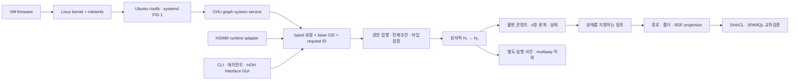

# CHU 구현 순서와 실행 계약

2026-09-30 · `SECONDARY_AI` · CHU 소유의 v0.1 실행 명세.
사용자 정체성은 [OWNER](../docs/agent-rules/OWNER.md)가 우선한다.
사용자는 2026-09-30에 **VM에서 직접 부팅하고 HSWM을 실행할 수 있는 CHU OS**를
목표로 정했다([원문](../canon/sources/USER_PRIMARY_VM_OS_HSWM_2026-09-30.txt)).
기존 연구 D04의 사용자 공간 오버레이 가정은 이 목표에 대해 대체되었다. Linux 커널·Ubuntu
rootfs·systemd 재사용은 첫 구현 제안일 뿐, 자체 커널 여부는 아직 사용자 결정이 아니다.

**첫 제품 단위는 콘텐츠 1개를 여러 그룹에 연결하고, 한 번의 재작성으로 수정하고,
이전 상태와 두 분기를 다시 조회할 수 있는 작은 커널이다.** 모든 기능을 이 경로 위에 쌓는다.



이 그림은 목표 구조다. 현재 참조 구현에는 권한 집행·영속 저장·동시 작성자가 없다.
`scripts/chu_model.py`는 외부 파일을 수정하거나 에이전트 작업을 실행하지 않는
메모리 모델로 핵심 데이터 계약을 검증한다. Rust 그래프 커널 계획은 유지하지만, 그것은
Linux 커널 자체와 다른 계층이다. 현재 VM substrate는 systemd·Node·cgroup v2·지속 상태만
검사하며 HSWM을 실행하지 않는다. 부팅 입력·증거·한계는 [`os/README.md`](../os/README.md)에 있다.

## 계층별 결정과 가져온 도구

| 부분 | 구현 방향 | 지금 쓸 도구 / 상태 |
|---|---|---|
| 의미와 정체성 | raw bytes SHA-256, 관계·상태는 버전 지정 인코딩 | Python 표준 hashlib로 참조 계약 실행; Rust의 기존 u64 해시는 별도 데모 |
| 타입 있는 n항 관계 | 기존 `vocab#`의 Hyperedge/Incidence/role/node/ordinal 재사용 | RDFLib + pySHACL로 실제 제약 검사 |
| 저장·재작성 | 불변 객체 + 추가 전용 사건, commit 경계에서 전체 검증 | 메모리 참조 모델 동작; 영속 backend는 T11–T13 |
| 분기·동일시 | 같은 base에서 여러 결과, 사건은 상태 CID와 분리 | 참조 모델 분기 동작; witness 검증·병합 정책은 T14 |
| 질의·뷰 | snapshot CID를 명시하고 국소 조건으로 탐색 | RDFLib/Oxigraph 두 엔진으로 명세 질의 비교; 커널 매처는 T20 |
| 분석·개발 | SQL 집계, 구조 검색, 설정 읽기, 시간 측정 | DuckDB, ast-grep, yq/jq, hyperfine는 개발 도구 |
| 인터페이스 | 같은 typed 요청/결과/오류 계약을 CLI·agent·HOH Interface GUI가 공유 | `./chu model`은 명세 데모; 제품 API는 T40/T42, HOH 호스트 연결은 T41 |
| VM 부팅 | firmware→kernel→initramfs→rootfs→PID 1을 실제 guest에서 통과 | T60–T62; 현재는 substrate probe, HSWM 실행 아님 |
| guest 서비스 | CHU store/txn을 systemd 서비스로 실행하고 guest 상태와 연결 | T63; 메모리 참조 모델로 대체할 수 없음 |
| HSWM | 선언된 runtime을 CHU agent port에 연결 | T64–T65; provider·자격증명·원격 리소스는 이미지에 넣지 않음 |

Oxigraph store와 DuckDB 테이블은 교환·검사·분석용 projection이다. 그것을 CHU의
콘텐츠 정체성 또는 커널 저장 정본으로 선택한 것은 아니다. 공유 KG writer도 추가하지 않는다.
SQLite의 트랜잭션이나 RocksDB의 배치 저장을 이용할 수 있지만 물리 backend 선택은
T12에서 재시작·실패 주입·회복·동시성 시험으로 결정한다. 현재 커널에 채택했다고 표시하지 않는다.

## GUI 방향 — HOH Interface (2026-10-07)

사용자는 CHU OS의 GUI를 `HOH_interface`로 만들자는 의견을 제시한 뒤,
사람이 보는 인터페이스는 **HOH Interface로 고정**하고 백엔드 OS를 정밀하게 만들도록 명시했다.
[첫 원문](../canon/sources/USER_PRIMARY_CHU_HOH_GUI_2026-10-07.txt)과
[후속 결정 원문](../canon/sources/USER_PRIMARY_CHU_HOH_BACKEND_2026-10-07.txt)을 별도로 보존한다.
이 결정을 기존 **T41**의 구현 대상으로 유지한다. 아래 연결 설계와 수용 조건은
`SECONDARY_AI` 제안이며, GUI 연결 완료나 세부 API 확정의 근거가 아니다.

대상은 [HOH Interface](https://github.com/gj3447/HOH-Interface) 저장소의 공통 UI 셸이다.
확인한 판본은 `940888483f24253491bda4cdfeef55528e6df7a2`이며,
[개념](https://github.com/gj3447/HOH-Interface/blob/940888483f24253491bda4cdfeef55528e6df7a2/docs/CONCEPT.md)과
[호스트 어댑터 계약](https://github.com/gj3447/HOH-Interface/blob/940888483f24253491bda4cdfeef55528e6df7a2/docs/ADAPTER.md)을 참조했다.
기존 HOH 세계관·게임·방송 플랫폼과 이 실행물을 동일시하지 않는다.

| 부분 | CHU에서의 역할과 연결 제안 |
|---|---|
| HOH 콘텐츠 영역 | CHU 노드·하이퍼엣지·문서·앱과 작업 결과를 여는 뷰. 그래프 탐색기도 등록된 앱으로 제공한다. |
| 피드·대시보드 | 같은 객체로 들어가는 질의 투영. 표시 위치·탐색 경로가 바뀌어도 CID를 바꾸거나 단일 부모를 강제하지 않는다. |
| HOH AI 대화 | 현재 대상과 버전을 지정해 CHU agent port에 작업을 요청하는 표면. 실제 실행 가능 여부는 호스트 상태로 표시한다. |
| CHU 호스트 어댑터 | HOH의 `open`·`saveState`·`chat` 등을 CHU의 조회·변경·작업 요청으로 변환한다. |
| CHU 그래프 서비스 | 콘텐츠·상태·권한·재작성·분기 이력을 소유하고 요청의 전제조건을 집행한다. |

첫 연결은 브라우저에서 HOH 셸을 재사용하는 방향이다. VM 안의 화면 실행 환경과
패키징은 후속 결정이다. `contentId`는 호스트의 객체 참조에 매핑하고 버전 CID와
snapshot/base CID를 별도로 보존한다. HOH의 `viewRevision`은 화면 맥락 버전이므로
CHU의 상태 CID와 같다고 가정하지 않는다. 어댑터가 현재 대상·버전·base·request ID를
묶어 전달하고 백엔드는 권한과 stale base를 검사해야 한다.

T41의 수용 조건은 같은 작업을 CLI와 GUI에서 수행했을 때 같은 재작성 의미와
로그 계약을 갖는 것, 한 CID를 여러 뷰에서 조회하는 것, 화면 이동 뒤 늦게 도착한
쓰기가 새 대상을 수정하지 않는 것, 백엔드 확인 뒤에만 저장 성공을 표시하는 것이다.
서로 다른 실행의 request ID와 사건은 각각 보존하므로 로그 바이트의 동일성을 요구하지 않는다.
현재 T41은 **pending**이며 CHU 어댑터·GUI 실행·VM 화면 통합은 아직 검증하지 않았다.

## 백엔드 부족분과 구현 우선순위 — 2026-10-07

`SECONDARY_AI` 평가. 사용자 결정은 HOH 화면의 고정과 백엔드 구현 우선이며,
아래 세부 순서·계약·수용 시나리오는 그에 대한 엔지니어링 제안이다.
검토 기준은 CHU `8e3626303527cc26ebd548a18f147252c5f14440`의 명세, 계획과
Python/Rust 코어다. 기존 [VM 관측](../os/README.md)은 과거 부팅 토대의 증거이며,
이번 평가는 새 VM 실행이나 HSWM 실행 검증을 포함하지 않는다.

현재 [Python 모델](../scripts/chu_model.py)의 `Model.states/events`는 메모리 사전이고
`apply`의 actor 검사는 URN 형식 검사다. [Rust 프로토타입](../chu_core_prototype/chu_core.rs)의
`BackendLocal`도 `HashMap`에 저장하며, CID는 `DefaultHasher/u64`, `Identity.sign`은
입력값을 그대로 반환한다. 따라서 여기서 검증한 재작성·분기 의미를 영속 저장,
인증 또는 실행 권한 보장으로 확대할 수 없다. [현재 Cargo 대상](../Cargo.toml)은
프로토타입 실행 파일이며, 제품용 커널 라이브러리 분리는 T10이다.

| 우선순위 / 관련 작업 | 부족한 구현·계약 | 완료를 판정할 시나리오 |
|---|---|---|
| P0 / T10–T14 | SHA-256 객체 저장, 객체·사건·branch head의 영속 commit, 동시 writer와 재시도 계약 | 쓰기 도중 프로세스를 중단해도 부분 commit을 노출하지 않는다. 재시작 후 같은 요청을 재전송해도 같은 논리 commit을 반환한다. 오래된 base가 새 head를 덮어쓰지 않는다. |
| P0 / T15, T40, T42 | 인증된 주체와 actor 연결, 읽기·쓰기 범위, capability 만료·철회·위임 집행 | 다른 사용자·앱의 자료 접근과 권한 밖 실행을 거부하고, 실행 중 철회와 캐시 무효화의 결과를 검증한다. actor 문자열이나 서명 모양의 필드만으로 허용하지 않는다. |
| P1 / T20–T22, T40–T42 | HOH·CLI·agent 공통 서비스 API: 객체 handle/버전, snapshot, 오류, 변경 알림·재접속 | HOH `viewRevision`과 CHU state CID를 구분하고, 동일 snapshot에서 같은 답을 반환한다. 재접속 후 누락된 변경을 재조회하며 늦은 작업 결과가 새 화면 대상을 수정하지 않는다. |
| P1 / T42, T63–T65 | 작업 수명주기·취소·시간 제한·CPU/메모리/저장량 제한, 외부 부작용 재시도 | 작업 실행 중 worker 종료·서비스 재시작·중복 전달·자원 초과를 주입해 결과와 이력을 확인한다. 그래프 commit 원자성을 외부 작업의 exactly-once 실행으로 간주하지 않는다. |
| P1 / T11–T14, T67 | 안정 handle과 버전 binding, 분기 충돌 정책, 이력 보존·GC·스키마 이관 | 문서 수정 후 기존 참조와 두 분기를 계속 조회한다. 삭제된 현재 노드와 이력의 물리 제거를 구분하고, 보존 중인 분기·snapshot이 참조하는 객체를 GC가 지우지 않는다. |
| P1 / T63, T66–T69 | 지속 guest 서비스, 고정 release, 업데이트·rollback, 백업 복원과 손상 탐지 | 같은 release에서 서비스·상태·권한·HSWM 결과를 연결한다. 실패한 이관을 복구하고 백업에서 실제로 복원한다. 정상 종료 뒤 부팅 성공과 전원 중단 복구를 별도 시험한다. |
| P1 / T06, T20–T21, T68–T69 | 입력 규모·읽기/쓰기 비율·자원 예산을 고정한 성능·회복 기준 | 규모별 조회/commit 지연, 메모리, 인덱스 비용과 회복 시간을 기록한다. 현재 모델의 전체 상태 복사·정렬 비용을 측정하고 인덱스·증분 처리와 비교한다. |

P0는 사용자 자료를 맡기기 전의 핵심 경계다. P1 항목도 후속 제품 수용에 필요하며,
현재 계획의 기존 작업과 연결한 평가이지 각 세부 계약의 구현 완료 선언이 아니다.
GC, 작업 취소·재시도, 알림 재접속, 백업 복원에는 아직 독립적인 수용 계약이 부족하다.
재작성 탐색은 깊이·분기 수·시간·메모리 예산을 가져야 하며, 현재 작업 상태와
탐색 중인 대안 분기의 보존 정책을 구분해야 한다. 모든 가능한 분기를 상시 생성하는
방식을 OS의 기본 동작으로 가정하지 않는다.
또한 현재 계획에서 T41은 T40만 직접 요구하고 T40은 T15를 요구하지 않는다.
쓰기 가능한 CLI/GUI를 열기 전에 권한 게이트를 계획과 제품 API 양쪽에 명시해야 한다.
현재 의존 그래프의 순서·완료 상태를 이번 평가로 자동 변경하지 않는다.

**첫 구현 묶음 제안:** T10부터 시작해 T11–T13의 작은 영속 커널을 만든다.
한 콘텐츠를 두 그룹에 연결하고, 버전을 수정한 뒤 재시작해 같은 결과를 읽으며,
동일 요청 재전송과 commit 도중 중단을 검사한다. 이후 분기와 권한 경계를 통과한
같은 서비스에 HOH 어댑터를 붙인다. HOH의 화면은 유지하고 이 경로의 실패 복구를
먼저 정밀하게 만든다. Linux 재사용과 자체 저수준 커널의 선택은 기존의 열린 결정으로 남는다.

## 실행 가능한 첫 묶음

```bash
./chu model demo --json
./chu model check --json
./chu model export --format turtle > .chu/model.ttl
./chu check --only kernel-contract --json
./chu model roadmap --json
```

데모는 이 저장소의 실제 `.md/.json/.rs/.py/.lean` 5개 파일을 읽고 바이트 CID로
묶는다. README 하나를 implementation/theory 두 그룹에 동시에 넣는다.
`requires-any`는 두 대안을 같은 관계 안에 보존하는 시험 예이며, 실제 프로젝트가
둘 중 하나만 필요하다는 사실 주장이나 스케줄러 실행이 아니다.
같은 상태에서 각각 다른 group 관계를 제거한 두 가지를 만든다. 원래 상태는 유지된다.

검사 산출물은 해당 `.chu/runs/<uuid>/model*.json`과 `model.ttl`에 남는다.
`./chu model check`는 RDF 제약 검사이며, 전체 동작·음성 대조군은 `./chu check`의
Python 테스트와 `kernel-contract`가 함께 검증한다.

질문과 검증 경로:

| 반드시 답할 질문 | 실행 검증 |
|---|---|
| 같은 바이트를 두 번 추가하면 정체성이 하나인가? | 알려진 SHA-256 벡터와 dedup 테스트 |
| 같은 노드가 두 그룹/뷰에 동시에 존재하는가? | `queries/membership.rq`, 정확한 group/member CID 비교 |
| OR 대안이 이진 AND 관계로 잘못 바뀌지 않는가? | `queries/alternatives.rq`, 하나의 clause와 두 candidate 확인 |
| 실패한 변경이 상태나 사건을 남기는가? | dangling·타입·role·삭제 전제조건 실패 후 모델 전체 불변 검사 |
| 같은 결과에 도달한 두 실행을 구분하는가? | request ID별 사건 두 개, 내용 상태 하나 테스트 |
| 분기에서 수정해도 다른 분기/이전 상태가 유지되는가? | `queries/branches.rq`와 가지별 정확한 소속 검사 |
| 다른 RDF 엔진에서도 답과 순서가 보존되는가? | RDF/JSON-LD 왕복 + Oxigraph/RDFLib 3개 질의 비교 |

## 다음 구현 순서와 종료 조건

정본 작업 ID와 의존성은 [계획 JSON](../plan/chu_os_plan.graph.json)에 유지한다.
`roadmap`은 각 n항 선행조건의 **모든 tail**이 완료됐는지 계산해 ready/blocked를 출력한다.

1. **T10 → T11:** 기존 Rust core를 라이브러리로 분리하고 기존 assert를 유지한다.
   blob put/get·동일 바이트 dedup·다른 프로세스에서 CID 재현을 참조 모델과 비교한다.
2. **T12 → T13:** 객체 저장, 재구축 가능한 인덱스, 검증 후 commit을 구현한다.
   재시작과 commit 전후 실패 주입, 같은 request의 재시도, stale base 검사를 통과해야 한다.
3. **T14 및 T20:** 가지 생성/조회와 국소 패턴 질의를 구현한다. 상태가 같아도 실행 경로는
   보존한다. strict CID와 witness에 의한 동일시를 섞지 않는다.
4. **T22 → T30/T32:** 이 명세의 incidence projection을 실제 저장소 export/import에 연결한다.
   바이트·role·ordinal·branch fidelity를 비교한 뒤 CHU 저장소 ingest/export를 수행한다.
5. **T15 → T40/T42:** capability grant의 실제 집행을 붙인 뒤 쓰기 가능한 agent API를 연다.
   이름이 `grant`인 관계가 있다는 이유만으로 OS 명령 실행을 허용하지 않는다.
6. **T41/T33/T52:** UI, 선택적 FUSE, 분산 backend는 앞선 커널 계약을 통과한 다음 붙인다.

현재 완료한 것은 T01–T05 명세와 참조 검증이다. T07의 수렴진화 연구,
영속 Rust 커널, 실제 권한 집행, FUSE, 333 동기화는 완료로 표시하지 않는다.

공식 설계 근거: [W3C n-ary relation Note](https://www.w3.org/TR/swbp-n-aryRelations/),
[SHACL](https://www.w3.org/TR/shacl/), [PROV-O](https://www.w3.org/TR/prov-o/).
2026-09-30 확인. 이는 아래 계약에 활용한 표준이며 CHU OS 자체의 표준 인증을 뜻하지 않는다.
